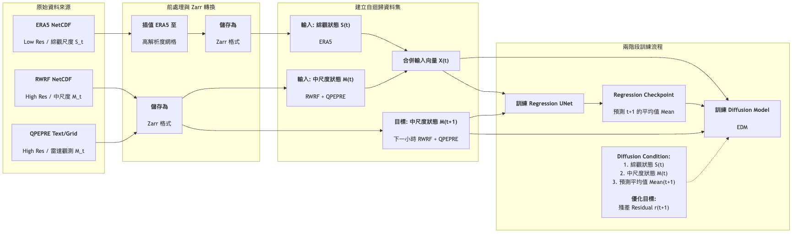
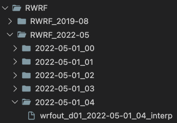
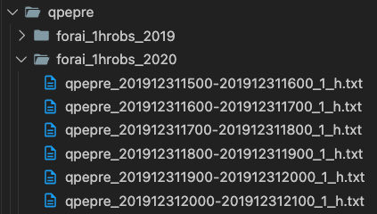
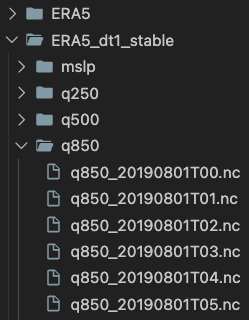
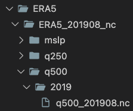

# Stormcast-NCDR (客製化訓練資料)

> **Adapted from NVIDIA [Physics‑NeMo / Stormcast](https://github.com/NVIDIA/physicsnemo)** and modified for Taiwan meteorological data.

[](#環境設置--environment-setup) [](#環境設置--environment-setup) [](https://pytorch.org/get-started/previous-versions/)  


## 目錄 (Table of Contents)
- [專案結構](#專案結構)
- [StormCast 架構概覽](#stormcast-架構概覽)
- [虛擬環境設置](#虛擬環境設置)
- [資料來源與用途](#資料來源與用途-data-sources-and-roles)
- [資料預處理](#資料預處理)
  - [資料放置](#資料放置)
  - [NC轉Zarr格式](#nc轉zarr格式--data_preprocessingnc_to_zarr)
- [Zarr檔案檢視](#zarr檔案檢視)
- [Stormcast模型訓練](#stormcast模型訓練)
  - [1. 訓練回歸模型 (Regression Model)](#1-訓練回歸模型-regression-model)
  - [2. 訓練擴散模型 (Diffusion Model)](#2-訓練擴散模型-diffusion-model)
  - [訓練注意事項](#訓練注意事項)

---

<div style="page-break-after: always;"></div>

## 專案結構

```
stormcast-ncdr/
├── data_preprocessing/          # 資料預處理工具
│   ├── nc_month_to_day/        # ERA5 月檔轉小時檔
│   ├── nc_to_zarr/             # NetCDF 轉 Zarr 格式
│   ├── plot_zarr/              # Zarr 資料視覺化
│   └── print_zarr_info/        # Zarr 檔案資訊檢視
│
├── physicsnemo/                 # NVIDIA Physics-NeMo 核心函式庫
│
├── stormcast/                   # StormCast 訓練腳本
│   ├── config/                 # 訓練配置檔案
│   ├── datasets/               # 資料集載入器
│   ├── utils/                  # 訓練工具函數
│   ├── train.py                # 主訓練程式
│   ├── inference.py            # 推論程式
│   ├── train_regression.sh     # 回歸模型訓練腳本 (一般環境)
│   ├── train_diffusion.sh      # 擴散模型訓練腳本 (一般環境)
│   ├── train_regression_nano5_single_node.sh    # 回歸模型訓練腳本 (Nano5 單節點)
│   ├── train_regression_nano5_multinode.sh      # 回歸模型訓練腳本 (Nano5 多節點)
│   ├── train_diffusion_nano5_single_node.sh     # 擴散模型訓練腳本 (Nano5 單節點)
│   └── train_diffusion_nano5_multinode.sh       # 擴散模型訓練腳本 (Nano5 多節點)
│
├── LICENSE                      # 授權條款
├── README.md                    # 專案說明文件
├── pyproject.toml              # Python 專案配置
└── requirements.txt            # Python 套件需求
```

---

## StormCast 架構概覽



---

<div style="page-break-after: always;"></div>

## 虛擬環境設置
1. 使用conda 建立虛擬環境，並安裝所需套件：
```bash
conda create -n stormcast_env python=3.10 -y
# 啟動虛擬環境
conda activate stormcast_env
```

2. 查詢cuda版本，並安裝對應的pytorch版本與相關套件：
```bash
# 查詢cuda版本
nvidia-smi
```

3. 下載pytorch
```bash
pip install torch==2.7.1 torchvision==0.22.1 torchaudio==2.7.1 --index-url https://download.pytorch.org/whl/cu118
```

4. 安裝其他所需套件：
```bash
# 確保在專案根目錄
cd stormcast-ncdr
pip install -e .
```
---

<div style="page-break-after: always;"></div>

## 資料來源與用途 (Data Sources and Roles)

本專案採用 **StormCast** 的自迴歸生成架構，整合了**綜觀尺度 (Synoptic Scale)** 與**對流尺度 (Convection-Allowing)** 的資料進行訓練。

資料集依據解析度與用途分為以下兩類：

### 1. 低解析度資料 (Low Resolution)

用於提供大範圍的大氣背景場，作為模型預測時的邊界條件與大尺度引導 (Conditioning)。

#### ERA5 (ECMWF Reanalysis v5)
- **角色**: Low Res Input (綜觀狀態 $S_t$)
- **用途**: 提供全球範圍的綜觀氣象變數（如位勢高度、大尺度風場、溫度等）。在 StormCast 架構中，這些資料被用來捕捉大氣的長波型態與綜觀強迫作用。

### 2. 高解析度資料 (High Resolution)

這是模型主要學習與預測的目標，包含精細的中尺度 (Mesoscale) 動力過程與降雨資訊。

#### RWRF (Radar-assimilated WRF)
- **角色**: High Res Input/Target (中尺度狀態 $M_t$)
- **用途**: 來自雷達資料同化的數值模式輸出，提供臺灣區域高解析度的動力與熱力場變數（如垂直風切、邊界層結構等）。

#### QPEPRE (Quantitative Precipitation Estimation)
- **角色**: High Res Input/Target (雷達觀測 $M_t$)
- **用途**: 高解析度的雷達定量降雨估計資料。
- **整合**: RWRF 與 QPEPRE 會被合併視為完整的中尺度狀態向量。模型在時間點 $t$ 接收這些高解析度資料，並學習預測時間點 $t+1$ 的狀態。

### 資料集總覽

| 資料集 (Dataset) | 解析度 (Resolution) | 角色 (Role) | 
|-----------------|---------------------|-------------|
| **ERA5** | Low Res (~25-30km) | 綜觀條件輸入 (Conditioning) | 
| **RWRF** | High Res (2-3km) | 模型狀態輸入 & 預測目標 | 
| **QPEPRE** | High Res (Grid) | 模型狀態輸入 & 預測目標 | 

---

<div style="page-break-after: always;"></div>

## 資料預處理
### 資料放置
Stormcast 分成高解析和低解析的影像資料，請依照以下步驟進行資料預處理：
1. **高解析資料小時nc檔 (RWRF)**
    - 請把檔案都放在**同一個主資料夾裡**
    - 檔名**必須**為此格式：wrfout_d01_YYYY-MM-DD_HH_interp , YYYY為年份，MM為月份，DD為日期，HH為小時
    - 以下面這張截圖為例，提供RWRF資料夾的絕對路徑，程式就可以搜尋裡面所有的RWRF檔：
    
2. **高解析資料小時txt檔（QPEPRE）**
    - 請把檔案都放在**同一個主資料夾裡**
    - 檔名**必須**為此格式：qpepre_YYYYMMDDHHMM-YYYYMMDDHHMM_1_h.txt
    - 以下面這張截圖為例，提供QPEPRE資料夾的絕對路徑，程式就可以搜尋裡面所有的QPEPRE txt檔：
    
3. **低解析資料小時nc檔 (ERA5)**
    - 請把檔案都放在**同一個資料夾裡**
    - 檔名**必須**為此格式：var_YYYYMMDDTHH.nc， var為變數名稱，YYYY為年份，MM為月份，DD為日期，HH為小時，T為時間標記，例子：t2m_20190830T11.nc
    - 以下面這張截圖為例，提供ERA5_dt1_stable資料夾的絕對路徑，程式就可以搜尋裡面所有的ERA5檔：
    

---

<div style="page-break-after: always;"></div>

### ERA5月檔轉小時檔
- 路徑 : `data_preprocessing/nc_month_to_day/`
- 如果ERA5為月檔，因月檔案太龐大直接轉換成zarr過程會不穩定
#### 請先使用 `plit_era5_monthly_to_daily.py` 轉成小時檔
  - 檔名 **必須** 為此格式：var_YYYYMM.nc， var為變數名稱，YYYY為年份，MM為月份，例子：q500_201908.nc
  
  ```yaml
  # 請到data_preprocessing/nc_month_to_day/config.yaml更改
root_dir: # 【需更動】ERA5 nc 月檔資料夾路徑
output_dir: # 【需更動】轉換後  ERA nc 小時檔放置資料夾路徑
time_variable: "valid_time" # ERA5 nc 檔裡時間變數的名稱
workers: 20 # 平行處理的核心數，可依據CPU核心數調整
dt_hours: 1 # 資料時間間隔，單位為小時
  ```
  - 執行轉換腳本
  ```bash
  # 執行前請先修改 config.yaml 裡的路徑參數
  python3 split_era5_monthly_to_daily.py --config config.yaml
  ```
  - [nano5] 執行轉換腳本
  ```bash
  # 執行前請先修改 config.yaml 裡的路徑參數
  srun --partition=dev --account=MST111414 \
  --gpus-per-node=1 --cpus-per-task=12 --ntasks=1 \
  python3 split_era5_monthly_to_daily.py --config config.yaml
  ```

---

<div style="page-break-after: always;"></div>


## NetCDF 轉 Zarr 資料預處理
### 路徑 : `data_preprocessing/nc_to_zarr/`
### 設定指南

#### 1. 資料路徑
在設定檔中配置輸入和輸出路徑：

```yaml
era5-path: "/path/to/ERA5/nc/hourly/data"     # ERA5 NetCDF 小時檔資料夾
rwrf-path: "/path/to/RWRF/nc/hourly/data"     # RWRF NetCDF 小時檔資料夾
qpepre-path: "/path/to/obs_1hrRain/txt/data"  # QPEPRE txt 小時檔資料夾
output-path: "/path/to/output/zarr"           # 輸出 Zarr 資料夾
```

#### 2. 時間範圍
定義訓練和驗證期間：

```yaml
train-ranges:  # 訓練期間
  - ["2022/01/01", "2022/01/20"] # 2022/01/01 到 2022/01/20

valid-ranges:  # 驗證期間
  - ["2022/01/21", "2022/01/31"] # 2022/01/21 到 2022/01/31
```

#### 3. 空間範圍
配置地理區域：

```yaml
domain-size: [224, 128]          # [緯度點數, 經度點數]
lon-bounds: [119.75, 122.25]     # [最小經度, 最大經度] 單位：度
lat-bounds: [21.6, 25.6]         # [最小緯度, 最大緯度] 單位：度
```

#### 4. 處理選項
調整平行處理設定：

```yaml
max-workers: 20  # 平行處理的 CPU 核心數
                 # 可依據可用的 CPU 核心數調整
```

<div style="page-break-after: always;"></div>

#### 5. 變數設定
配置要處理的變數：

**覆寫特定變數列表：**
```yaml
era5-vars: "mslp,sp,t2m,u10,v10"      # 逗號分隔的 ERA5 變數
rwrf-vars: "u10,v10,t2m,sp,msl"       # 逗號分隔的 RWRF 變數
invariant-vars: "lsm,orog"            # 逗號分隔的不變變數
```

**或使用 null 來載入完整定義：**
```yaml
era5-vars: null      # 使用下方的 era5-variables 列表
rwrf-vars: null      # 使用下方的 rwrf-variables 列表
invariant-vars: null # 使用下方的 invariant-variables 列表

era5-variables:
  - "mslp"
  - "sp"
  # ... 新增更多變數

rwrf-variables:
  - "u10"
  - "v10"
  # ... 新增更多變數

invariant-variables:
  - "lsm"
  - "orog"
```

#### 6. log設定
配置log行為：

```yaml
log-level: "DEBUG"           # 選項：DEBUG, INFO, WARNING, ERROR
log-file: "nc_to_zarr.log"   # log檔案名稱
```

<div style="page-break-after: always;"></div>

## 使用方式

1. 進入 `nc_to_zarr` 目錄：

    ```bash
    cd data_preprocessing/nc_to_zarr
    ```

2. 轉換 NetCDF 檔案為 Zarr 格式： 

    a. 一般環境：
    ```bash
    python nc_to_zarr.py -c config.yaml
    ```
    
    b. 在nano5上，使用SLURM提交工作：
    ```bash
    srun --partition=dev --account=MST111414 \
    --gpus-per-node=1 --cpus-per-task=12 --ntasks=1 \
    python3 nc_to_zarr.py -c config_nano5.yaml
    ```

---

<div style="page-break-after: always;"></div>

## Zarr檔案檢視
### 使用 `data_preprocessing/print_zarr_info/`
1. 執行檢視腳本
```bash
# 【需更動】執行腳本，請將 <path to zarr> 替換為欲檢視的 zarr 檔案路徑
python3 print_zarr_info.py <path to zarr>
```

2. 使用 `data_preprocessing/plot_zarr/` 進行Zarr資料視覺化

#### 列出所有可用變數
```bash
# 查看 Zarr 檔案中所有可用的變數
python3 plot_zarr.py <zarr檔案路徑> --list-variables
```

#### 列出所有時間步
```bash
# 查看 Zarr 檔案中所有時間步及其有效性
python3 plot_zarr.py <zarr檔案路徑> --list-times
```

#### 繪製特定變數
```bash
# 繪製 ERA5 500hPa 風場 u 分量，時間索引為 0
python3 plot_zarr.py <zarr檔案路徑> --source LowRes --variable "u500" --time 0

# 繪製 StormCast 高解析度 10米風場 u 分量，時間索引為 12
python3 plot_zarr.py <zarr檔案路徑> --source HighRes --variable "u10" --time 12
```

---

<div style="page-break-after: always;"></div>

## Stormcast模型訓練

### 1. 訓練回歸模型 (Regression Model)
回歸模型用於直接預測氣象變數，是擴散模型的基礎。

#### 修改訓練參數

##### 一般環境設定
請到 `stormcast/train_regression.sh` 修改以下參數：

```bash
# --- Torchrun 設定 ---
number_of_nodes=1          # 節點數量
gpus_per_node=2            # 每個節點的 GPU 數量

# --- 一般訓練設定 ---
experiment_name="regression_ncdr"                                              # 實驗名稱
training_output_dir="/project/n/desmond/diffusion_output/regression"         # 訓練輸出目錄
run_id="0"                                                                    # 執行編號

# --- 日誌參數 ---
print_progress_freq=25     # 每 N 步驟印出訓練進度
checkpoint_freq=1000       # 每 N 步驟儲存檢查點
validation_freq=50         # 每 N 步驟進行驗證

# --- 訓練參數 ---
batch_size=12              # 批次大小
lr=4E-4                    # 學習率
lr_rampup_steps=1000       # 學習率暖身步數
total_train_steps=16000    # 總訓練步數
clip_grad_norm=-1          # 梯度裁剪閾值，設為 -1 表示停用
loss='regression'          # 損失函數類型

# --- 驗證參數 ---
validation_plot_variables="[t2m,u10,v10,qpepre]"  # 要繪製的驗證變數

# --- 可選輸出 ---
output_nc="true"           # 是否輸出 NetCDF 檔案
output_nc_freq=5           # 每 N 次驗證輸出一次 NetCDF（5 表示每 5 次驗證輸出一次）

# --- 資料集參數 ---
location="/project/n/desmond/Stormcast_test/Zarr_test_optimized_skip_invalid"  # Zarr 資料位置
HighRes_img_size="[224,128]"                                                    # 高解析度影像大小
exp_train_zarrs="[train]"                                       # 訓練用 Zarr 檔案
train_dates="[2019/08/01,2019/08/17]"                                          # 訓練日期範圍
exp_valid_zarrs="[valid]"                                       # 驗證用 Zarr 檔案
valid_dates="[2019/08/18,2019/08/31]"                                          # 驗證日期範圍
kept_LowRes_channels="all"                                                      # 保留的低解析度通道
kept_HighRes_channels="all"                                                     # 保留的高解析度通道
```

<div style="page-break-after: always;"></div>

##### Nano5 單節點設定
請到 `stormcast/train_regression_nano5_single_node.sh` 修改以下參數：

```bash
# --- SLURM 作業設定 ---
#SBATCH --job-name=test_1_month_reg   # 工作名稱
#SBATCH --partition=normal            # 分區名稱 (normal/normal2/dev)
#SBATCH --account=MST111414           # 帳號名稱
#SBATCH --nodes=1                     # 節點數量
#SBATCH --ntasks-per-node=1           # 每個節點的任務數量
#SBATCH --cpus-per-task=12            # 每個任務使用的 CPU 核心數
#SBATCH --gpus-per-node=1             # 每個節點的 GPU 數量
#SBATCH --time=48:00:00               # 最大執行時間 (小時:分鐘:秒)

# --- 訓練設定 ---
stormcast_train="/work/jasjou71/code/stormcast-ncdr/stormcast/train.py"  # train.py 的路徑
config="--config-name regression.yaml"                                     # 配置檔名稱
experiment_name="regression_ncdr"                                          # 實驗名稱
training_output_dir="/work/jasjou71/code/stormcast-ncdr/stormcast/nano5_output/test_1_month_regression"  # 訓練輸出目錄
run_id="0"                                                                 # 執行編號

# --- 日誌參數 ---
print_progress_freq=25     # 每 N 步驟印出訓練進度
checkpoint_freq=1000       # 每 N 步驟儲存檢查點
validation_freq=50         # 每 N 步驟進行驗證

# --- 訓練參數 ---
batch_size=12              # 批次大小
lr=4E-4                    # 學習率
lr_rampup_steps=1000       # 學習率暖身步數
total_train_steps=16000    # 總訓練步數
clip_grad_norm=-1          # 梯度裁剪閾值，設為 -1 表示停用
loss='regression'          # 損失函數類型

# --- 驗證參數 ---
validation_plot_variables="[t2m,u10,v10,qpepre]"  # 要繪製的驗證變數

# --- 可選輸出 ---
output_nc="true"           # 是否輸出 NetCDF 檔案
output_nc_freq=5           # 每 N 次驗證輸出一次 NetCDF

# --- 資料集參數 ---
location="/work/jasjou71/data/test_1_month_data/stormcast_zarr/"  # Zarr 資料位置
HighRes_img_size="[224,128]"                                       # 高解析度影像大小
exp_train_zarrs="[train]"                                          # 訓練用 Zarr 檔案
train_dates="[2022/01/01,2022/01/20]"                             # 訓練日期範圍
exp_valid_zarrs="[valid]"                                          # 驗證用 Zarr 檔案
valid_dates="[2022/01/21,2022/01/31]"                             # 驗證日期範圍
kept_LowRes_channels="all"                                         # 保留的低解析度通道
kept_HighRes_channels="all"                                        # 保留的高解析度通道
```

<div style="page-break-after: always;"></div>


##### Nano5 多節點設定
請到 `stormcast/train_regression_nano5_multinode.sh` 修改以下參數：

```bash
# --- SLURM 作業設定 ---
#SBATCH --job-name=cor_reg_mulnode    # 工作名稱
#SBATCH --partition=normal            # 分區名稱 (normal/normal2/dev)
#SBATCH --account=MST111414           # 帳號名稱
#SBATCH --nodes=2                     # 節點數量 (多節點訓練)
#SBATCH --ntasks-per-node=1           # 每個節點的任務數量
#SBATCH --cpus-per-task=12            # 每個任務使用的 CPU 核心數
#SBATCH --gpus-per-node=2             # 每個節點的 GPU 數量
#SBATCH --time=48:00:00               # 最大執行時間 (小時:分鐘:秒)

# --- 多節點環境設定 ---
MASTER_PORT=29500                     # 主節點通訊埠 (可自訂)

# --- 訓練設定 ---
stormcast_train="/work/jasjou71/code/stormcast-ncdr/stormcast/train.py"  # train.py 的路徑
config="--config-name regression.yaml"                                     # 配置檔名稱
experiment_name="regression_ncdr"                                          # 實驗名稱
training_output_dir="/work/jasjou71/code/stormcast-ncdr/stormcast/nano5_output/test_1_month_regression"  # 訓練輸出目錄
run_id="0"                                                                 # 執行編號

# --- 日誌參數 ---
print_progress_freq=25     # 每 N 步驟印出訓練進度
checkpoint_freq=1000       # 每 N 步驟儲存檢查點
validation_freq=50         # 每 N 步驟進行驗證

# --- 訓練參數 ---
batch_size=64              # 批次大小 (多節點可調大)
lr=4E-4                    # 學習率
lr_rampup_steps=1000       # 學習率暖身步數
total_train_steps=16000    # 總訓練步數
clip_grad_norm=-1          # 梯度裁剪閾值，設為 -1 表示停用
loss='regression'          # 損失函數類型

# --- 驗證參數 ---
validation_plot_variables="[t2m,u10,v10,qpepre]"  # 要繪製的驗證變數

# --- 可選輸出 ---
output_nc="true"           # 是否輸出 NetCDF 檔案
output_nc_freq=5           # 每 N 次驗證輸出一次 NetCDF

# --- 資料集參數 ---
location="/work/jasjou71/data/test_1_month_data/stormcast_zarr/"  # Zarr 資料位置
HighRes_img_size="[224,128]"                                       # 高解析度影像大小
exp_train_zarrs="[train]"                                          # 訓練用 Zarr 檔案
train_dates="[2022/01/01,2022/01/20]"                             # 訓練日期範圍
exp_valid_zarrs="[valid]  "                                          # 驗證用 Zarr 檔案
valid_dates="[2022/01/21,2022/01/31]"                             # 驗證日期範圍
kept_LowRes_channels="all"                                         # 保留的低解析度通道
kept_HighRes_channels="all"                                        # 保留的高解析度通道
```

#### 執行訓練

##### 一般環境
```bash
# 確保在 stormcast 目錄下
cd stormcast

# 執行訓練腳本
./train_regression.sh
```

##### Nano5 環境
```bash
# 確保在 stormcast 目錄下
cd stormcast

# 單節點訓練
sbatch train_regression_nano5_single_node.sh

# 多節點訓練
sbatch train_regression_nano5_multinode.sh
```

#### 訓練輸出
訓練完成後，會在 `training_output_dir/experiment_name/run_id/` 產生以下檔案：
- `checkpoints_regression/`: 模型檢查點檔案
- `loss_curves.png`: 訓練與驗證損失曲線圖
- `train_loss.csv`: 訓練損失記錄
- `valid_loss.csv`: 驗證損失記錄
- `rmse_<變數名>.csv`: 各變數的 RMSE 記錄
- `mae_<變數名>.csv`: 各變數的 MAE 記錄
- `ps1d_<變數名>.csv`: 各變數的功率譜記錄
- `images/`: 驗證圖片資料夾
- `netcdf_outputs/`: NetCDF 輸出檔案（若 output_nc=true）

---

<div style="page-break-after: always;"></div>


### 2. 訓練擴散模型 (Diffusion Model)
擴散模型用於生成高品質的氣象預測，需要先訓練好回歸模型。

#### 修改訓練參數

##### 一般環境設定
請到 `stormcast/train_diffusion.sh` 修改以下參數：

```bash
# --- Torchrun 設定 ---
number_of_nodes=1          # 節點數量
gpus_per_node=2            # 每個節點的 GPU 數量

# --- 一般訓練設定 ---
experiment_name="diffusion_ncdr"                                                      # 實驗名稱
training_output_dir="/home/master/13/dczy/code/stormcast-ncdr/data/Stormcast_test/diffusion"  # 訓練輸出目錄
run_id="0"                                                                            # 執行編號

# --- 日誌參數 ---
print_progress_freq=25     # 每 N 步驟印出訓練進度
checkpoint_freq=1000       # 每 N 步驟儲存檢查點
validation_freq=50         # 每 N 步驟進行驗證

# --- 訓練參數 ---
batch_size=16              # 批次大小
lr=4E-4                    # 學習率
lr_rampup_steps=1000       # 學習率暖身步數
total_train_steps=800000   # 總訓練步數
clip_grad_norm=-1          # 梯度裁剪閾值，設為 -1 表示停用
loss='edm'                 # 損失函數類型（擴散模型使用 'edm'）

# --- 驗證參數 ---
validation_plot_variables="[t2m,u10,v10,qpepre]"  # 要繪製的驗證變數

# --- 可選輸出 ---
output_nc="true"           # 是否輸出 NetCDF 檔案
output_nc_freq=5           # 每 N 次驗證輸出一次 NetCDF（5 表示每 5 次驗證輸出一次）

# --- 資料集參數 ---
location="/project/n/desmond/Stormcast_test/Zarr_test_optimized_skip_invalid"  # Zarr 資料位置
HighRes_img_size="[224,128]"                                                    # 高解析度影像大小
exp_train_zarrs="[train]"                                       # 訓練用 Zarr 檔案
train_dates="[2019/08/01,2019/08/17]"                                          # 訓練日期範圍
exp_valid_zarrs="[valid]"                                       # 驗證用 Zarr 檔案
valid_dates="[2019/08/18,2019/08/31]"                                          # 驗證日期範圍
kept_LowRes_channels="all"                                                      # 保留的低解析度通道
kept_HighRes_channels="all"                                                     # 保留的高解析度通道

# --- 模型參數 ---
# 【重要】預訓練回歸模型的路徑，用於擴散模型的條件輸入
regression_weights="/home/master/13/dczy/code/stormcast-ncdr/data/Stormcast_test/regression/regression_ncdr/run_0/checkpoints_regression/StormCastUNet.0.1000.mdlus"
```

<div style="page-break-after: always;"></div>

##### Nano5 單節點設定
請到 `stormcast/train_diffusion_nano5_single_node.sh` 修改以下參數：

```bash
# --- SLURM 作業設定 ---
#SBATCH --job-name=corr_dif           # 工作名稱
#SBATCH --partition=normal2           # 分區名稱 (normal/normal2/dev)
#SBATCH --account=MST111414           # 帳號名稱
#SBATCH --nodes=1                     # 節點數量
#SBATCH --ntasks-per-node=1           # 每個節點的任務數量
#SBATCH --cpus-per-task=12            # 每個任務使用的 CPU 核心數
#SBATCH --gpus-per-node=1             # 每個節點的 GPU 數量
#SBATCH --time=48:00:00               # 最大執行時間 (小時:分鐘:秒)

# --- 訓練設定 ---
stormcast_train="/work/jasjou71/code/stormcast-ncdr/stormcast/train.py"  # train.py 的路徑
config="--config-name diffusion.yaml"                                      # 配置檔名稱
experiment_name="diffusion_ncdr"                                           # 實驗名稱
training_output_dir="/work/jasjou71/code/stormcast-ncdr/stormcast/nano5_output/test_1_month_diffusion"  # 訓練輸出目錄
run_id="0"                                                                 # 執行編號

# --- 日誌參數 ---
print_progress_freq=25     # 每 N 步驟印出訓練進度
checkpoint_freq=1000       # 每 N 步驟儲存檢查點
validation_freq=50         # 每 N 步驟進行驗證

# --- 訓練參數 ---
batch_size=12              # 批次大小
lr=4E-4                    # 學習率
lr_rampup_steps=1000       # 學習率暖身步數
total_train_steps=16000    # 總訓練步數
clip_grad_norm=-1          # 梯度裁剪閾值，設為 -1 表示停用
loss='edm'                 # 損失函數類型（擴散模型使用 'edm'）

# --- 驗證參數 ---
validation_plot_variables="[t2m,u10,v10,qpepre]"  # 要繪製的驗證變數

# --- 可選輸出 ---
output_nc="true"           # 是否輸出 NetCDF 檔案
output_nc_freq=5           # 每 N 次驗證輸出一次 NetCDF

# --- 資料集參數 ---
location="/work/jasjou71/data/test_1_month_data/stormcast_zarr/"  # Zarr 資料位置
HighRes_img_size="[224,128]"                                       # 高解析度影像大小
exp_train_zarrs="[train]"                                          # 訓練用 Zarr 檔案
train_dates="[2022/01/01,2022/01/20]"                             # 訓練日期範圍
exp_valid_zarrs="[valid]"                                          # 驗證用 Zarr 檔案
valid_dates="[2022/01/21,2022/01/31]"                             # 驗證日期範圍
kept_LowRes_channels="all"                                         # 保留的低解析度通道
kept_HighRes_channels="all"                                        # 保留的高解析度通道

# --- 模型參數 ---
# 【重要】預訓練回歸模型的路徑，用於擴散模型的條件輸入
regression_weights="/work/jasjou71/code/stormcast-ncdr/stormcast/nano5_output/test_1_month_regression/regression_ncdr/run_0/checkpoints_regression/StormCastUNet.0.1000.mdlus"
```

<div style="page-break-after: always;"></div>


##### Nano5 多節點設定
請到 `stormcast/train_diffusion_nano5_multinode.sh` 修改以下參數：

```bash
# --- SLURM 作業設定 ---
#SBATCH --job-name=corr_dif_mulnode   # 工作名稱
#SBATCH --partition=normal2           # 分區名稱 (normal/normal2/dev)
#SBATCH --account=MST111414           # 帳號名稱
#SBATCH --nodes=2                     # 節點數量 (多節點訓練)
#SBATCH --ntasks-per-node=1           # 每個節點的任務數量
#SBATCH --cpus-per-task=12            # 每個任務使用的 CPU 核心數
#SBATCH --gpus-per-node=2             # 每個節點的 GPU 數量
#SBATCH --time=48:00:00               # 最大執行時間 (小時:分鐘:秒)

# --- 多節點環境設定 ---
MASTER_PORT=29500                     # 主節點通訊埠 (可自訂)

# --- 訓練設定 ---
stormcast_train="/work/jasjou71/code/stormcast-ncdr/stormcast/train.py"  # train.py 的路徑
config="--config-name diffusion.yaml"                                      # 配置檔名稱
experiment_name="diffusion_ncdr"                                           # 實驗名稱
training_output_dir="/work/jasjou71/code/stormcast-ncdr/stormcast/nano5_output/test_1_month_diffusion"  # 訓練輸出目錄
run_id="0"                                                                 # 執行編號

# --- 日誌參數 ---
print_progress_freq=25     # 每 N 步驟印出訓練進度
checkpoint_freq=1000       # 每 N 步驟儲存檢查點
validation_freq=50         # 每 N 步驟進行驗證

# --- 訓練參數 ---
batch_size=12              # 批次大小 (多節點可調大)
lr=4E-4                    # 學習率
lr_rampup_steps=1000       # 學習率暖身步數
total_train_steps=400000   # 總訓練步數
clip_grad_norm=-1          # 梯度裁剪閾值，設為 -1 表示停用
loss='edm'                 # 損失函數類型（擴散模型使用 'edm'）

# --- 驗證參數 ---
validation_plot_variables="[t2m,u10,v10,qpepre]"  # 要繪製的驗證變數

# --- 可選輸出 ---
output_nc="true"           # 是否輸出 NetCDF 檔案
output_nc_freq=5           # 每 N 次驗證輸出一次 NetCDF

# --- 資料集參數 ---
location="/work/jasjou71/data/test_1_month_data/stormcast_zarr/"  # Zarr 資料位置
HighRes_img_size="[224,128]"                                       # 高解析度影像大小
exp_train_zarrs="[train]"                                          # 訓練用 Zarr 檔案
train_dates="[2022/01/01,2022/01/20]"                             # 訓練日期範圍
exp_valid_zarrs="[valid]"                                          # 驗證用 Zarr 檔案
valid_dates="[2022/01/21,2022/01/31]"                             # 驗證日期範圍
kept_LowRes_channels="all"                                         # 保留的低解析度通道
kept_HighRes_channels="all"                                        # 保留的高解析度通道

# --- 模型參數 ---
# 【重要】預訓練回歸模型的路徑，用於擴散模型的條件輸入
regression_weights="/work/jasjou71/code/stormcast-ncdr/stormcast/nano5_output/test_1_month_regression/regression_ncdr/run_0/checkpoints_regression/StormCastUNet.0.1000.mdlus"
```

#### 執行訓練

##### 一般環境
```bash
# 確保在 stormcast 目錄下
cd stormcast

# 執行訓練腳本
./train_diffusion.sh
```

##### Nano5 環境
```bash
# 確保在 stormcast 目錄下
cd stormcast

# 單節點訓練
sbatch train_diffusion_nano5_single_node.sh

# 多節點訓練
sbatch train_diffusion_nano5_multinode.sh
```

#### 訓練輸出
訓練完成後，會在 `training_output_dir/experiment_name/run_id/` 產生以下檔案：
- `checkpoints_diffusion/`: 模型檢查點檔案
- `loss_curves.png`: 訓練與驗證損失曲線圖
- `train_loss.csv`: 訓練損失記錄
- `valid_loss.csv`: 驗證損失記錄
- `rmse_<變數名>.csv`: 各變數的 RMSE 記錄
- `mae_<變數名>.csv`: 各變數的 MAE 記錄
- `ps1d_<變數名>.csv`: 各變數的功率譜記錄
- `images/`: 驗證圖片資料夾
- `netcdf_outputs/`: NetCDF 輸出檔案（若 output_nc=true）

---

### 訓練注意事項

#### 訓練監控
- 訓練過程中會自動產生 `loss_curves.png`，可即時查看訓練進度
- CSV 檔案記錄詳細的訓練指標，可用於後續分析

#### 檢查點恢復
- 訓練會自動從最新的檢查點恢復
- 若要從特定檢查點開始，請修改配置檔中的 `resume_checkpoint` 參數

#### NetCDF 輸出
- `output_nc=true` 時會輸出驗證結果的 NetCDF 檔案
- `output_nc_freq` 控制輸出頻率，避免產生過多檔案
- NetCDF 檔案可用 `plot_zarr.py` 或其他 NetCDF 工具視覺化

---