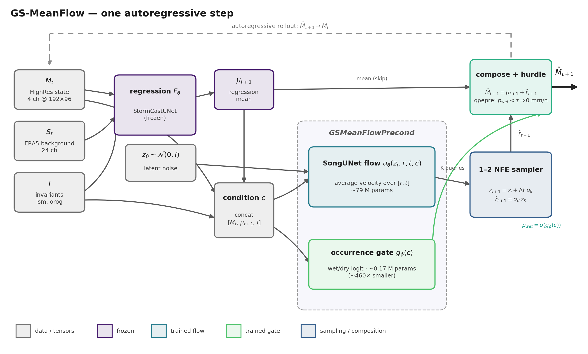
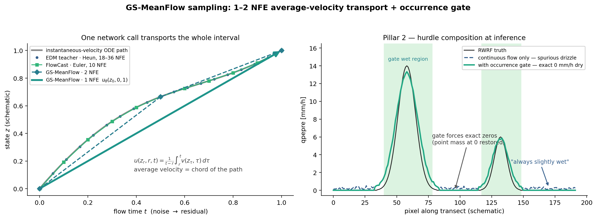
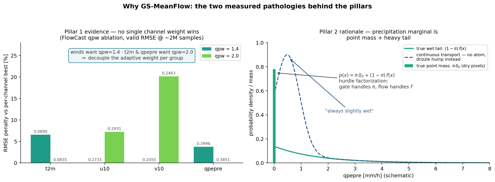
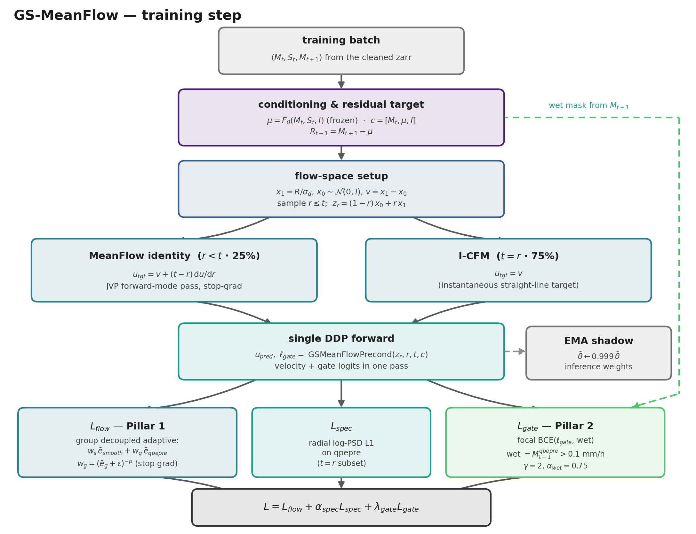

# GS-MeanFlow — Methodology

**Gated-Spectral MeanFlow**: a 1–2 NFE generative residual head for the Taiwan
RWRF StormCast stack, designed to beat EDM diffusion, FlowCast (CFM) and
vanilla MeanFlow on the four high-res hourly variables
(`t2m, u10, v10, qpepre`). This document is the method reference; the quick
operational guide lives in [../README.md](../README.md).

All figures are generated by [make_method_figures.py](make_method_figures.py)
(matplotlib, viridis palette per the thesis-wide `thesis_style.py` convention):

```bash
python stormcast/gated-spectral_meanflow/docs/make_method_figures.py
```

---

## 1. Problem setup and notation

StormCast is a two-stage autoregressive forecaster on a Taiwan domain
(192×96 after the cleaning crop, hourly steps):

| Symbol | Meaning | Shape |
|---|---|---|
| $M_t$ | HighRes state (t2m, u10, v10, qpepre) | (4, 192, 96) |
| $S_t$ | ERA5/RWRF LowRes background | (24, 192, 96) |
| $I$ | invariants (lsm, orog) | (2, 192, 96) |
| $\mu_{t+1} = F_\theta(M_t, S_t, I)$ | frozen deterministic regression mean | (4, 192, 96) |
| $R_{t+1} = M_{t+1} - \mu_{t+1}$ | the generative target: the residual | (4, 192, 96) |
| $c = [\,M_t,\ \mu_{t+1},\ I\,]$ | conditioning bundle (channel concat) | (10, 192, 96) |

The generative head models $p(R_{t+1} \mid c)$. EDM does this with a
multi-step diffusion (18–36 NFE), FlowCast with a 10-step Euler CFM flow.
GS-MeanFlow keeps MeanFlow's average-velocity formulation (1–2 NFE) and adds
two architectural/objective pillars. qpepre is stored as
$\mathrm{log1p}(\text{mm/h})$ then standardized; `denormalize_state`
inverts both.



**One autoregressive step.** The frozen regression supplies the mean
$\mu_{t+1}$ and the conditioning bundle $c$. The `GSMeanFlowPrecond` holds two
heads: the SongUNet average-velocity flow $u_\theta(z_r, r, t, c)$ (~79 M
params) and the occurrence gate $g_\phi(c)$ (~0.17 M params, ~460× smaller —
effectively free at inference). The sampler transports latent noise to the
standardized residual in $K \in \{1, 2\}$ segments, the composition adds the
mean back, and the hurdle forces confidently-dry qpepre pixels to **exact**
0 mm/h. The prediction $\hat M_{t+1}$ feeds back autoregressively.

---

## 2. Background: the MeanFlow average velocity

In the repo's flow convention ($t{=}0$ noise → $t{=}1$ data, linear path
$z_t = (1-t)x_0 + t x_1$, instantaneous velocity $v = x_1 - x_0$, all in the
standardized residual space $x_1 = R/\sigma_d$), MeanFlow (Geng et al. 2025)
learns the *average* velocity over an interval:

$$u(z_r, r, t) \;=\; \frac{1}{t-r}\int_r^t v(z_\tau, \tau)\, d\tau ,$$

so a single network evaluation transports the state across the whole
interval: $z_t = z_r + (t-r)\, u(z_r, r, t)$. Training does not integrate
anything; it exploits the **MeanFlow identity**

$$u(z_r, r, t) \;=\; v \;+\; (t-r)\,\frac{\mathrm{d}}{\mathrm{d}r} u(z_r, r, t),$$

where $\mathrm{d}/\mathrm{d}r$ is the total derivative along the trajectory,
evaluated with one forward-mode JVP and treated as a constant (stop-grad). At
$r = t$ the identity collapses to plain I-CFM, which is what 75 % of the
batch trains on (`mf_ratio = 0.25`).



**Left:** the average velocity is the *chord* of the ODE path — one call
spans what FlowCast needs 10 Euler steps and EDM needs 18–36 Heun
evaluations to traverse. **Right:** the Pillar-2 hurdle at inference —
without the gate, a continuous transport leaves spurious drizzle on every dry
pixel; the gate restores the exact zeros.

---

## 3. The two pillars (and the evidence for them)



### Pillar 1 — group-decoupled adaptive weighting

**Measured pathology** (left panel; FlowCast qpw ablation, CLAUDE.md §6.5):
no single qpepre channel weight wins all four variables — winds prefer
`qpw=1.4`, t2m and qpepre prefer `qpw=2.0`. The deeper issue is that
MeanFlow's adaptive weight $w = 1/(\overline{\mathrm{mse}}+\epsilon)^p$ is
computed per sample over **all** channels, so a sample with a hard
precipitation scene down-weights its own easy wind channels — cross-channel
gradient interference baked into a shared scalar.

**Fix.** Split the per-sample squared error into two groups — *smooth*
$(t2m, u10, v10)$ and *precip* $(qpepre)$ — and give each its own adaptive
weight:

$$L_{flow} \;=\; \mathbb{E}\big[\, w_s\, \bar e_{smooth} + w_q\, \bar e_{qpepre} \,\big],
\qquad w_g = (\bar e_g + \epsilon)^{-p}\ \text{(stop-grad)} .$$

The per-channel $\beta$ weights (`channel_weights = [1,1,1,2]`) are kept on
top, unchanged from FlowCast/MeanFlow.

### Pillar 2 — occurrence (hurdle) gate

**Structural pathology** (right panel): the qpepre marginal is a **point mass
at zero** (dry pixels, ~majority of the domain) plus a heavy right tail. A
continuous transport from $\mathcal{N}(0, I)$ cannot emit exact zeros — the
atom gets smeared into a drizzle hump, the documented *"always slightly wet"*
failure (CLAUDE.md §8) that destroys CSI/bias at low thresholds.

**Fix.** Factor the precipitation as a hurdle model,
$p(x) = \pi\,\delta_0 + (1-\pi) f(x)$: a tiny deterministic 2-level U-Net
$g_\phi(c)$ predicts the per-pixel wet probability from the conditioning
only (never the noisy flow state), trained with focal BCE
($\gamma = 2$, $\alpha_{wet} = 0.75$) against the mask
$M_{t+1}^{qpepre} > 0.1$ mm/h (the lowest CSI threshold of the metrics
suite, converted into standardized-log1p space through the loader's exact
pipeline). At inference, pixels with $p_{wet} < \tau$ (default 0.5) are set
to the standardized value of 0 mm/h, which `denormalize_state` maps to
**exactly** 0.

### What is deliberately *not* changed

Backbone (SongUNet), optimizer (AdamW 5e-4, cosine + warmup), EMA (0.999),
$\sigma_d = 0.5$, `mf_ratio`, the qpepre log-PSD spectral term, the dataset
and channel order — all identical to the MeanFlow run, so **GS-MeanFlow vs
MeanFlow is an A/B on the two pillars alone**. With `gate_weight = 0` and the
group split disabled, the model reduces exactly to vanilla MeanFlow.

---

## 4. Training objective



Per batch: build $c$ and the residual target $R$, standardize, draw
$(r, t)$, interpolate $z_r$, compute the velocity target (JVP MeanFlow
identity on the 25 % $r{<}t$ subset, I-CFM elsewhere), then run **one**
gradient-carrying forward that returns both the velocity and the gate logits
(so DDP sees every parameter each step — no `find_unused_parameters`; the
JVP target pass uses the flow-only path of the unwrapped module). The total
loss:

$$L \;=\; \underbrace{L_{flow}}_{\text{Pillar 1, group-decoupled}}
\;+\; \alpha_{spec}\, \underbrace{L_{spec}}_{\text{radial log-PSD L1, qpepre, } t=r}
\;+\; \lambda_{gate}\, \underbrace{L_{gate}}_{\text{Pillar 2, focal BCE}} .$$

| Knob | Default | Meaning |
|---|---|---|
| `mf_ratio` | 0.25 | fraction of batch on the $r<t$ identity |
| `adaptive_p`, `adaptive_eps` | 1.0, 1e-3 | adaptive weight exponent / stabilizer (per group) |
| `channel_weights` | [1,1,1,2] | per-channel $\beta$ (order: u10, v10, t2m, qpepre on the cleaned set) |
| `spectral_weight` ($\alpha_{spec}$) | 0.1 | log-PSD term on qpepre |
| `gate_weight` ($\lambda_{gate}$) | 1.0 | occurrence term; 0 disables Pillar 2 |
| `gate_focal_gamma`, `gate_focal_alpha` | 2.0, 0.75 | focal focusing / wet-class weighting |
| `gate_threshold_mm` | 0.1 | physical wet definition (matches CSI grid) |
| `gate_prob_threshold` ($\tau$) | 0.5 | inference dry/wet decision |
| `ema_decay` | 0.999 | EMA shadow = the inference weights |

Watch `wet_fraction` vs `pred_wet_fraction` in the logs/W&B: a calibrated
gate converges to the climatological wet fraction; a stuck-at-dry or
stuck-at-wet gate shows up immediately there.

## 5. Sampling

1. $z \sim \mathcal{N}(0, I)$; for $K$ segments:
   $z \leftarrow z + \Delta t\, u_\theta(z, t_i, t_{i+1}, c)$  (NFE = $K$, default 2, headline 1).
2. $\hat r_{t+1} = \sigma_d\, z$; $\hat M_{t+1} = \mu_{t+1} + \hat r_{t+1}$.
3. Hurdle: $p_{wet} = \sigma(g_\phi(c))$; where $p_{wet} < \tau$, set the
   qpepre channel to the standardized value of 0 mm/h (exact dry).
4. Feed $\hat M_{t+1}$ back for the next hour. The gate is applied *before*
   the feedback so the rollout sees self-consistent dry fields.

Total cost per step: $K$ flow evaluations + one ~0.2 % overhead gate pass.
**Always load the EMA shadow (`ema_state.pt`)**, not the online checkpoint.

## 6. Falsification plan / ablation ladder

| Step | Config | Isolates | Expected mover |
|---|---|---|---|
| 0 | vanilla MeanFlow (`train_meanflow.py`) | baseline | — |
| 1 | GS, `gate_weight=0` | Pillar 1 | u10/v10/t2m RMSE ↓ |
| 2 | GS, full | Pillar 2 | qpepre CSI/bias ↑, RMSE ↓ |
| 2b | GS, full, `inference.gsmeanflow.apply_gate=false` | gate at inference only | isolates train-time vs sample-time gate effect |

Matched sample budget (~2 M), scored on the §7 suite (RMSE/MAE, CSI/FSS/bias
at 0.1–20 mm/h, radial log-PSD, rollout, CRPS). Known risk: decoupled
objectives optimize marginals — check multivariate calibration (rank
histograms), which can regress while per-channel RMSE improves.

## 7. References

- Geng et al., 2025 — *Mean Flows for One-step Generative Modeling* (MeanFlow identity, adaptive weighting).
- Lipman et al., 2023; Tong et al., 2024 — flow matching / I-CFM.
- Ribeiro & Pucer, 2025 — *FlowCast* (CFM for precipitation nowcasting).
- Lin et al., 2017 — focal loss (the gate objective).
- Cragg, 1971 — hurdle models (the occurrence/intensity factorization).
- NVIDIA StormCast (Pathak et al., 2024) — the two-stage regression + generative-residual design.
