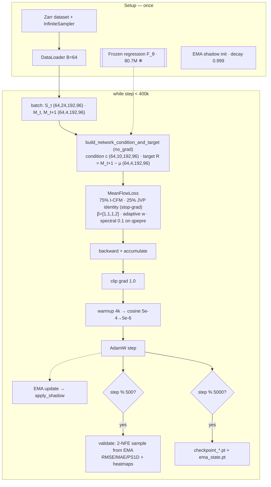

# MeanFlow — architecture & workflow drawing instructions

Instructions for drawing the architecture and training workflow of
[train_meanflow.py](train_meanflow.py) (entry point) →
[utils/trainer_meanflow.py](utils/trainer_meanflow.py) (loop) →
[utils/meanflow_precond.py](utils/meanflow_precond.py) (network wrapper) →
[utils/meanflow_loss.py](utils/meanflow_loss.py) (objective).
All tensor shapes and parameter counts below were measured against the actual
code (canonical cleaned-dataset configuration) — use them verbatim as arrow /
box labels. Produce **three figures**:

1. **Figure 1 — Two-stage architecture** (data flow through the frozen
   regression net and the MeanFlow residual head, with tensor shapes).
2. **Figure 2 — Training workflow** (one optimizer step of
   `meanflow_training_loop`, including the JVP loss branch, EMA, and the
   periodic validation/checkpoint side-paths).
3. **Figure 3 — Sampling path** (1–2 NFE average-velocity inference; small).

Mermaid, TikZ, or draw.io are all fine; a Mermaid starter for Figure 2 is at
the bottom. Style conventions for every figure:

- **Solid arrows** = gradient-carrying forward pass.
- **Dashed arrows** = `no_grad` / stop-gradient / frozen paths (regression
  net, JVP target pass, EMA copy).
- **Grey / snowflake-marked boxes** = frozen or non-trainable modules.
- **Green box** = the single trainable module (the MeanFlow SongUNet).
- Label every tensor arrow with `(B, C, H, W)` using B = 64, H×W = 192×96.

---

## 0. Ground-truth sizes (canonical cleaned dataset, 192×96)

All canonical runs (§6 of the repo CLAUDE.md) train on the cleaned zettabyte
dataset at grid **192×96** with HighRes channel order `[u10, v10, t2m, qpepre]`
(qpepre stored as log1p(mm/h), then per-channel standardized). The shipped
[config/dataset/era5_rwrf_qpepre.yaml](config/dataset/era5_rwrf_qpepre.yaml)
lists the legacy `HighRes_img_size: [224, 128]` — the grid is taken from
`dataset.image_shape()` at runtime, so draw **192×96** and footnote the legacy
224×128 variant if needed.

| Tensor | Shape (train step) | Contents |
|---|---|---|
| `background` (S_t) | (64, **24**, 192, 96) | LowRes ERA5 conditioning: mslp, t2m, u10, v10 + q/t/u/v/z at 1000/850/500/250 hPa |
| `state[0]` (M_t) | (64, **4**, 192, 96) | HighRes state at t: u10, v10, t2m, qpepre |
| `state[1]` (M_{t+1}) | (64, **4**, 192, 96) | HighRes target at t+1 (same channels) |
| invariants I | (64, **2**, 192, 96) | lsm, orog (broadcast from (2, 192, 96)) |
| μ_{t+1} = regression output | (64, 4, 192, 96) | deterministic mean |
| residual target R = M_{t+1} − μ_{t+1} | (64, 4, 192, 96) | what MeanFlow learns |
| condition c (MeanFlow head) | (64, **10**, 192, 96) | concat[M_t (4), μ_{t+1} (4), I (2)] — **no background** |
| UNet input | (64, **14**, 192, 96) | concat[z_r (4), c (10)] |
| UNet output u_θ | (64, **4**, 192, 96) | average velocity in standardized residual space |

Channel bookkeeping (from `num_condition_channels` in
[utils/trainer_meanflow.py:233](utils/trainer_meanflow.py#L233) and
`diffusion_conditions: ["state", "regression", "invariant"]` in
[config/model/meanflow.yaml](config/model/meanflow.yaml)):

- **Regression net input**: `regression_conditions = ["state", "background", "invariant"]`
  → 4 + 24 + 2 = **30 channels in → 4 out**.
- **MeanFlow head condition**: `["state", "regression", "invariant"]`
  → 4 + 4 + 2 = **10 channels**; with the 4 flow-state channels z_r the
  SongUNet sees **14 in → 4 out**.

### Network sizes (measured by instantiation at 192×96)

| Module | Params | Notes |
|---|---:|---|
| **MeanFlowPrecond** (trainable student) | **81.04 M** (81,040,772) | SongUNet backbone, 14 in / 4 out, incl. 2.36 M spatial pos-embed (1×128×192×96) |
| StormCastUNet regression (frozen) | 80.73 M (80,726,404) | 30 in / 4 out, `embedding_type="zero"` |
| EMA shadow of the student | 81.04 M (non-trainable copy) | updated per step, used for all validation/inference |

At the legacy 224×128 grid only the spatial embedding grows
(1×128×224×128 = 3.67 M → total ≈ 82.35 M).

### SongUNet backbone hyperparameters

From `get_preconditioned_architecture(name="meanflow", ...)` in
[utils/nn.py:71](utils/nn.py#L71) plus physicsnemo `SongUNet` defaults:

- `model_channels = 128`, `channel_mult = [1, 2, 2, 2, 2]` → **5 resolution
  levels**, widths **128 / 256 / 256 / 256 / 256**.
- Level resolutions (draw as the classic U shape):
  `192×96 → 96×48 → 48×24 → 24×12 → 12×6`.
- `num_blocks = 4` residual blocks per encoder level (decoder gets
  `num_blocks + 1 = 5` per level), SiLU activations, dropout 0.1.
- `attn_resolutions = []` — **no per-level self-attention**, but the SongUNet
  bottleneck block `dec.12x12_in0` is hard-wired with `attention=True`
  ([physicsnemo/models/diffusion/song_unet.py:463](../physicsnemo/models/diffusion/song_unet.py#L463)),
  so the network contains **exactly one single-head self-attention** at 12×6
  (72 tokens). Draw it as a small attn marker on the bottleneck.
- `additive_pos_embed = True` — learned additive spatial embedding
  (1, 128, 192, 96) added after the first conv.
- Embedding MLP width: 128 → 512 (`channel_mult_emb = 4`).

### Full layer inventory (measured by instantiating the canonical net)

Everything below was dumped from
`get_preconditioned_architecture("meanflow", target_channels=4,
conditional_channels=10, img_resolution=(192, 96), attn_resolutions=[])` —
i.e. the exact canonical-run network (81,040,772 params; forward check
(2, 4, 192, 96) in → (2, 4, 192, 96) out). ModuleDict keys are named after
the **y-resolution only** (`192x192_…` really runs at 192×96), a SongUNet
naming quirk — keep the H×W labels below in the figures.

**Parameter budget by top-level module:**

| Module | Params |
|---|---:|
| mapping network (`map_noise/map_augment/map_layer0/map_layer1`) | 332,800 |
| `spatial_emb` (additive pos. embed, 1×128×192×96) | 2,359,296 |
| encoder `enc` (25 modules) | 26,712,448 |
| decoder `dec` (32 modules) | 51,636,228 |
| **total** | **81,040,772** |

55 `UNetBlock`s in total, exactly 1 `Attention` module (`dec.12x12_in0.attn`).

#### Mapping network (conditioning vector, per sample)

```
r·1000 ─ map_noise: PositionalEmbedding(128, endpoint=True)   0 params
         f_i = 10000^(−i/63), i=0..63 → [cos|sin] → halves swapped → (128,)
(t−r)  ─ sin/cos on 16 log-spaced freqs 1→1000 (gap_freqs buffer) → (32,)
         └ map_augment: Linear 32→128, no bias                4,096 params
emb = map_noise(r·1000) + map_augment(FF(t−r))
emb ─ map_layer0: Linear 128→512 + SiLU                      66,048 params
emb ─ map_layer1: Linear 512→512 + SiLU                     262,656 params
→ 512-d conditioning vector fed to the `affine` layer of every UNetBlock
```

#### UNetBlock anatomy (draw once as a legend inset)

Every block is the DDPM++-style residual block from
[physicsnemo/models/diffusion/layers.py:629](../physicsnemo/models/diffusion/layers.py#L629),
with `adaptive_scale=False` (shift-only conditioning, no scale):

```
x ── GroupNorm(32 groups, eps 1e-6) + SiLU ── Conv 3×3 (C_in→C_out)
   ── (+) affine: Linear 512→C_out of emb, broadcast per-pixel  [shift-only FiLM]
   ── GroupNorm + SiLU ── Dropout 0.1 ── Conv 3×3 (C_out→C_out, near-zero init)
   ── (+) skip(x): identity, or 1×1 conv when C or resolution changes
   ── × 1/√2                                   [skip_scale]
   ── [bottleneck in0 only] single-head self-attention, then × 1/√2 again
```

- Up/down blocks fold the 2× resampling into `conv0` and the 1×1 skip using a
  fixed `[1,1]` box filter (nearest-neighbour up / 2×2 mean down).
- The lone attention block: GroupNorm → 1×1 qkv conv (256→768) → 1-head
  scaled-dot-product over 12×6 = 72 tokens → 1×1 proj (zero-init) → residual
  add (263,680 of `in0`'s 1,576,192 params).
- Weight init: Xavier-uniform everywhere; `conv1`, attn `proj` and the output
  `aux_conv` are scaled by 1e-5 ("zero-init" residual branches).

#### Encoder (`model.enc`, 26.71 M) — input concat[z_r, c] (B, 14, 192, 96)

| Module(s) | Type | C_in→C_out | H×W | Params |
|---|---|---|---|---:|
| `192x192_conv` | Conv 3×3 (+ add `spatial_emb` after) | 14→128 | 192×96 | 16,256 |
| `192x192_block0…3` | UNetBlock ×4 | 128→128 | 192×96 | 4 × 361,344 |
| `96x96_down` | UNetBlock, down 2× | 128→128 | →96×48 | 377,856 |
| `96x96_block0` | UNetBlock (1×1 skip) | 128→256 | 96×48 | 1,050,368 |
| `96x96_block1…3` | UNetBlock ×3 | 256→256 | 96×48 | 3 × 1,312,512 |
| `48x48_down` | UNetBlock, down 2× | 256→256 | →48×24 | 1,378,304 |
| `48x48_block0…3` | UNetBlock ×4 | 256→256 | 48×24 | 4 × 1,312,512 |
| `24x24_down` | UNetBlock, down 2× | 256→256 | →24×12 | 1,378,304 |
| `24x24_block0…3` | UNetBlock ×4 | 256→256 | 24×12 | 4 × 1,312,512 |
| `12x12_down` | UNetBlock, down 2× | 256→256 | →12×6 | 1,378,304 |
| `12x12_block0…3` | UNetBlock ×4 | 256→256 | 12×6 | 4 × 1,312,512 |

Each of the 25 non-aux encoder outputs (the first conv + 24 blocks) is pushed
onto the **skip stack** for the decoder.

#### Decoder (`model.dec`, 51.64 M) — mirrors the U, 5 blocks per level

Each decoder block concatenates one popped encoder skip onto its input, so
C_in = C_dec + C_skip:

| Module(s) | Type | C_in→C_out | H×W | Params |
|---|---|---|---|---:|
| `12x12_in0` | UNetBlock + **self-attn (1 head)** | 256→256 | 12×6 | 1,576,192 |
| `12x12_in1` | UNetBlock | 256→256 | 12×6 | 1,312,512 |
| `12x12_block0…4` | UNetBlock ×5 (skip-concat) | 512→256 | 12×6 | 5 × 2,034,176 |
| `24x24_up` | UNetBlock, up 2× | 256→256 | →24×12 | 1,378,304 |
| `24x24_block0…4` | UNetBlock ×5 (skip-concat) | 512→256 | 24×12 | 5 × 2,034,176 |
| `48x48_up` | UNetBlock, up 2× | 256→256 | →48×24 | 1,378,304 |
| `48x48_block0…4` | UNetBlock ×5 (skip-concat) | 512→256 | 48×24 | 5 × 2,034,176 |
| `96x96_up` | UNetBlock, up 2× | 256→256 | →96×48 | 1,378,304 |
| `96x96_block0…3` | UNetBlock ×4 (skip-concat) | 512→256 | 96×48 | 4 × 2,034,176 |
| `96x96_block4` | UNetBlock (128-ch skip) | 384→256 | 96×48 | 1,706,240 |
| `192x192_up` | UNetBlock, up 2× | 256→256 | →192×96 | 1,378,304 |
| `192x192_block0` | UNetBlock (128-ch skip) | 384→128 | 192×96 | 706,048 |
| `192x192_block1…4` | UNetBlock ×4 (skip-concat) | 256→128 | 192×96 | 4 × 541,952 |
| `192x192_aux_norm` | GroupNorm(128) + SiLU | 128 | 192×96 | 256 |
| `192x192_aux_conv` | **Output head** Conv 3×3, zero-init | 128→4 | 192×96 | 4,612 |

#### Params per resolution level (for width-proportional U drawings)

| Level (H×W) | Encoder | Decoder |
|---|---:|---:|
| 192×96 | 1.46 M | 4.26 M |
| 96×48 | 5.37 M | 11.22 M |
| 48×24 | 6.63 M | 11.55 M |
| 24×12 | 6.63 M | 11.55 M |
| 12×6 (bottleneck) | 6.63 M | 13.06 M |

### Time conditioning (the MeanFlow-specific part — give it its own inset)

`MeanFlowPrecond.forward(x, r, t, condition)`
([utils/meanflow_precond.py:167](utils/meanflow_precond.py#L167)) injects the
two times through **two separate pathways**:

- **State time r** (position on the flow trajectory, r ∈ [0,1]):
  scaled by `time_scale = 1000` → SongUNet's positional **noise embedding**
  (same convention as FlowCast; r = t recovers the FlowCast field).
- **Interval length (t − r)**: 16 log-spaced frequencies (1 → 1000) →
  **32-dim sin/cos Fourier features** → `map_augment` Linear(32 → 128) →
  summed into the same 512-dim conditioning vector.

Other wrapper constants: `sigma_data = 0.5` (residual standardization),
`gap_embed_dim = 32`, `label_dim = 0` (unconditional in the class sense).

---

## Figure 1 — Two-stage architecture

Left-to-right data flow, one forecast step t → t+1. Boxes and arrows:

1. **Inputs** (three stacked source boxes): `M_t (4, 192, 96)`,
   `S_t (24, 192, 96)`, `I (2, 192, 96)`.
2. **Stage 1 — frozen regression** (grey, snowflake):
   `StormCastUNet F_θ, 80.7 M, 30 ch in` consuming concat[M_t, S_t, I];
   output arrow `μ_{t+1} (4, 192, 96)`. All arrows in/out dashed (no_grad).
3. **Condition bundle** (small concat node): c = concat[M_t, μ_{t+1}, I]
   → `(10, 192, 96)`. Annotate: *background S_t feeds only the regression
   net, not the residual head*.
4. **Noise source**: `z_0 ~ N(0, I) (4, 192, 96)` (train: z_r on the linear
   path; inference: pure noise).
5. **Stage 2 — MeanFlow head** (green, trainable):
   `MeanFlowPrecond u_θ — SongUNet 81.0 M, 14 ch in / 4 ch out,
   5 levels ×[128,256,256,256,256], single self-attn at the 12×6 bottleneck`.
   Inputs: concat[z_r, c] `(14, 192, 96)` plus the two scalar times r, t
   (draw the time-conditioning inset from §0 beside it).
6. **Output**: `u_θ(z_r, r, t, c) (4, 192, 96)` — average velocity over
   [r, t] in standardized residual space (× σ_data = 0.5 to de-standardize).
7. **Reconstruction node** (inference only, can be greyed):
   `X̂_{t+1} = μ_{t+1} + R̂_{t+1}`.
8. Caption formula: `u(z_r, r, t) = 1/(t−r) ∫_r^t v(z_τ, τ) dτ`, with the
   note *r = t ⇒ instantaneous velocity (FlowCast field); strict
   generalization on the same backbone*.

---

## Figure 2 — Training workflow (`meanflow_training_loop`)

Top-to-bottom flowchart of **one global step**, wrapped in a
`while total_steps < 400 000` loop frame. Draw these stages in order:

1. **Setup lane** (above the loop, one row of small boxes): zarr dataset →
   `InfiniteSampler` + DataLoader (no epochs); frozen regression net loaded
   from `.mdlus`; student + **EMA shadow** (decay 0.999) initialized;
   `MeanFlowLoss`; AdamW (lr 5e-4, β=(0.9, 0.999), wd 1e-4); DDP wrap;
   auto-resume from `checkpoints_meanflow/` + `ema_state.pt`.
2. **Micro-batch loop** (inner frame, `num_accumulation_rounds` iterations;
   with global batch 64 on 1 GPU this is 1 round — annotate
   `local_batch × world_size × rounds = 64`):
   a. `next(dataset_iterator)` → background (64,24,192,96) + state pair.
   b. `build_network_condition_and_target` (dashed border — runs under
      no_grad): regression forward → μ_{t+1}; **target R = M_{t+1} − μ_{t+1}
      (64,4,192,96)**; condition c (64,10,192,96).
   c. **MeanFlowLoss** — expand as its own sub-box, this is the heart of the
      figure (see loss inset below).
   d. `loss.backward()` (grads accumulate; DDP all-reduce only on the last
      round via `no_sync()`).
3. **Optimizer stage** (sequence of small boxes):
   `clip_grad_norm_ (max 1.0)` → **LR schedule**: linear warmup 0→5e-4 over
   4 000 steps, then cosine decay to 5e-6 (1 %) at step 400 000 →
   `nan_to_num` gradient sanitize (JVP/AMP guard) → `optimizer.step()`.
4. **EMA update** (dashed arrow from student weights):
   `ema.update(decay=0.999)` → `ema.apply_shadow(ema_net)`.
5. **Periodic side-paths** (branch diamonds off the main line):
   - every **500 steps → Validation** (dashed frame, all no_grad): sample
     residual from the **EMA net** with `meanflow_model_forward`
     (`valid_num_steps = 2` NFE) → X̂ = R̂ + μ → per-channel RMSE/MAE +
     radial PS1D CSVs, heatmap PNGs, optional NetCDF; valid loss evaluated
     against the EMA weights.
   - every **5 000 steps → Checkpoint** (rank 0): `save_checkpoint`
     (student + optimizer) **and** `ema_state.pt` — annotate *EMA file is the
     inference weight*.
   - every step: train_loss.csv / W&B scalars (loss, pointwise, spectral,
     mf_fraction, lr).
6. Numerics annotation on the loop frame: default `fp_optimizations: fp32`
   with TF32 explicitly disabled (JVP precision); optional bf16 autocast.

### Loss inset (MeanFlowLoss — draw inside step 2c)

Per micro-batch of B = 64 samples:

1. Standardize: `x1 = R / 0.5`; draw `x0 ~ N(0,I)`; `v = x1 − x0`.
2. Sample times: `(r, t) = sort(U(1e-5, 1−1e-5)²)`; Bernoulli split
   **mf_ratio = 0.25**:
   - **~75 % branch (r := t)** — plain I-CFM: `u_target = v`.
   - **~25 % branch (r < t)** — MeanFlow identity: one **forward-mode JVP**
     through the *unwrapped* net under no_grad (dashed box), tangent
     `(v, 1, 0)` for `(z, r, t)`:
     `u_target = v + (t − r) · du/dr` — mark **stop-grad** on the arrow out.
3. Interpolate `z_r = (1−r)·x0 + r·x1` and run the **single
   gradient-carrying forward** over the full batch:
   `u_pred = u_θ(z_r, r, t, c)` (solid green arrow — the only one).
4. Pointwise term: `‖u_pred − u_target‖²` × per-channel weights
   **β = [1, 1, 1, 2] (qpepre ×2)** → per-sample mean → **adaptive weight
   w = 1/(mse + 1e-3)^1.0** (stop-grad).
5. Spectral term (r = t subset only): implied clean field
   `x1_pred = z_r + (1−r)·u_pred` → radial log-PSD L1 on **qpepre**,
   weight **0.1**. (The no-spectral-loss ablation sets this to 0 — the
   checkpoint used in the thesis main experiment; footnote it.)
6. Output node: `loss = pointwise + spectral` (+ logged `mf_fraction`).

---

## Figure 3 — Sampling path (small)

One row: `z_0 ~ N(0,I) (4, 192, 96)` → repeated block
`z_{i+1} = z_i + (t_{i+1} − t_i) · u_θ(z_i, t_i, t_{i+1}, c)` over
`num_steps` equal segments of [0, 1] → `R̂ = z_1 × 0.5` → `X̂_{t+1} = μ_{t+1} + R̂`.

Annotate the NFE comparison (the point of the method):

| Sampler | NFE per forecast step |
|---|---:|
| **MeanFlow** (this figure) | **1–2** (default 2; `num_steps=1` = one-NFE headline) |
| FlowCast (Euler) | 10 |
| EDM teacher (Heun) | 18–36 |

---

## Mermaid starter (Figure 2 skeleton)


